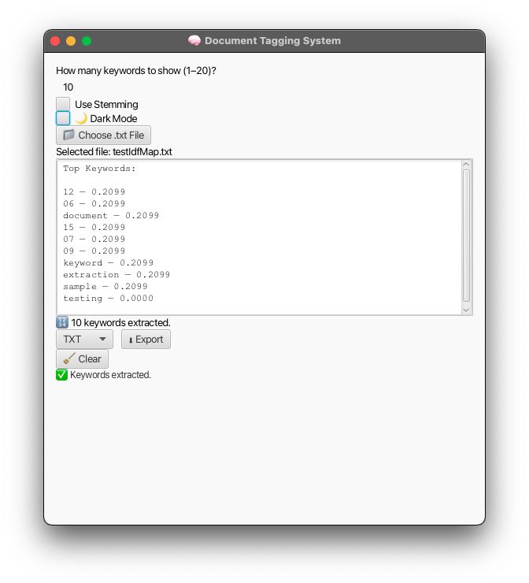
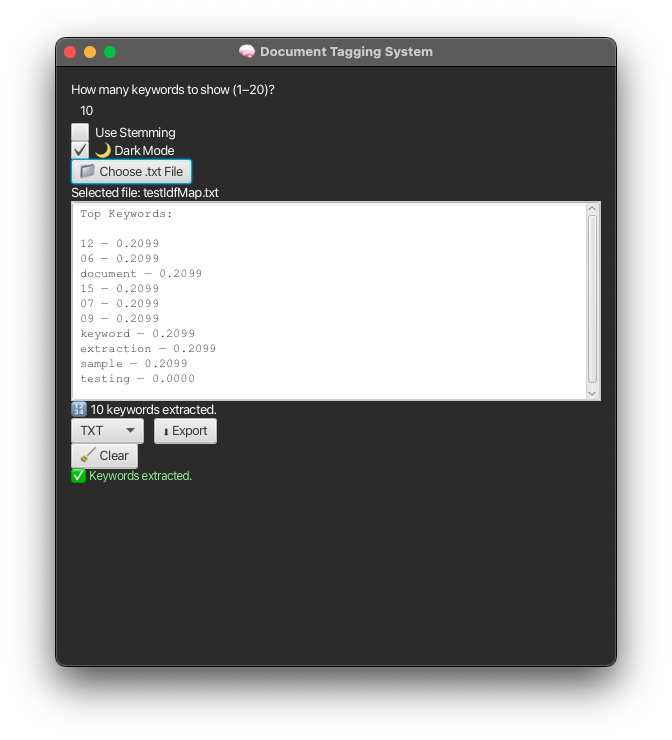
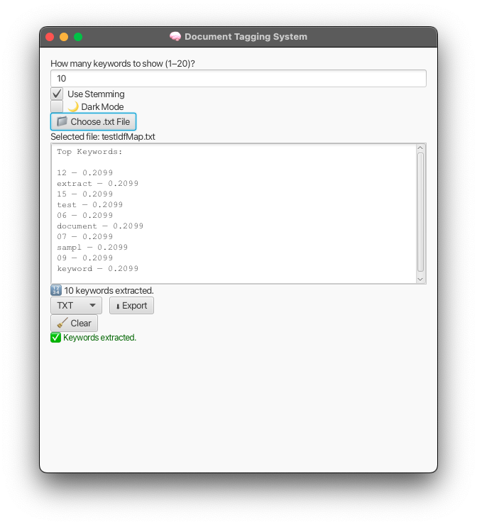
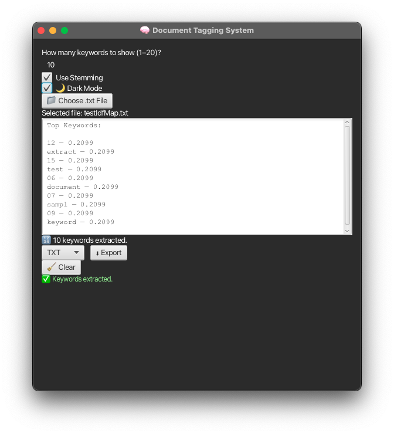

## Dataset Notes

Large training datasets are not included in this repository to keep cloning lightweight.
If you use the News Category dataset, place it here:

`trainingData/News/News_Category_Dataset_v3.txt`

# 🧠 Document Tagging System

This is a Java-based capstone project that automatically extracts top keywords from `.txt` documents using **TF-IDF** (Term Frequency - Inverse Document Frequency). Users can select a file, specify the number of keywords (up to 20), and choose whether to apply stemming for better keyword generalization. The result is a ranked list of keywords that can be exported or used for tagging and indexing purposes.


📘 **Want to learn how to use this system?**  
→ [Open the User Guide](./UserGuide.md)
---

## 📚 Documentation

- [🔍 User Guide](./UserGuide.md): Full walkthrough for GUI + CLI
- [🖼️ Screenshots](./screenshots): GUI preview (light/dark, stemming ON/OFF)

---

## 💡 Features

- JavaFX GUI interface for document selection and keyword display
- Toggle stemming and dark mode
- Export keywords to TXT or CSV
- Batch runner for automated testing (`BatchTestRunner`)
- Custom TF-IDF keyword extractor with fallback support
- IDF training model builder from any folder of `.txt` files
- Full test suite with JUnit 5 + Mockito for unit and integration tests
- Robust error handling for malformed inputs, empty files, and invalid paths
- Modular code structure and configurable input/output setup
- Java 21 / Gradle-based build system

---

## 💻 GUI Preview

### Light Mode


### Dark Mode


### Stemming Comparison - Light Mode


### Stemming Comparison - Dark Mode


---

## 📃 Tech Stack

- Java 21
- JavaFX 24.0.1
- Gradle
- Lombok
- JUnit 5
- Mockito

---

## 📂 Project Structure

```
capstone.documenttaggingsystem/
├── TaggingApp.java                # Main GUI app
├── TaggingCli.java                # Console-based interface
├── FileParser.java                # Cleans and normalizes .txt files
├── IdfTrainer.java                # Builds IDF map from document folders
├── IdfLoader.java                 # Loads IDF map from file
├── TfIdfCalculator.java           # Handles TF, IDF, and keyword ranking
├── WordStemmer.java               # Handles word stemming
├── FileUtils.java                 # File walker and loader helpers
├── BatchTestRunner.java           # Batch testing class
├── test/                          # JUnit + Mockito test cases
│   └── testDocuments/             # Controlled test .txt inputs
└── trainingData/                  # Your custom documents for IDF training
```

---

## 🏃‍♂️Build & Run

> Make sure you have Java 21+ and JavaFX SDK 24.0.1 configured.

### Running via IntelliJ

1. Clone this repository.
2. Open the project in IntelliJ IDEA.
3. Set JavaFX SDK under module dependencies.
4. To launch the GUI:  
   Run `TaggingApp.java` or use:

   ```bash
   ./gradlew run
   ```

### Running via CLI

To use the console-based interface instead of GUI:

```bash
./gradlew run --args='cli'
```

### Run Tests

```bash
./gradlew test
```

---

## 🔧 How It Works

1. **Training Phase**: All `.txt` files in the `trainingData/` folder are parsed to calculate IDF values and generate a map.
2. **Tagging Phase**: When a new `.txt` document is selected, it’s cleaned and tokenized (optionally stemmed) and compared against the IDF map.
3. **Keyword Ranking**: A TF-IDF score is calculated for each word, and the top N keywords are returned.

---

## 📈 Output Example

```
Top Keywords (with stemming enabled):

data — 1.2345
machin — 1.1004
model — 0.9981
```

---

## 🔍 Manual Testing Strategy

Use manual exploratory tests to validate:
- GUI responsiveness and layout
- Correct file selection behavior
- Stemming toggle functionality
- Dark mode visibility
- Export functionality (TXT and CSV)

---

## 👨‍💼 Contributors

- Ashley Caceres Pagan — Backend logic, GUI functionality, mock testing, visual design, final system integration  
- Ryo Kilgannon — TF-IDF logic, stemming integration, Lucene enhancements  
- Danton Robinson — Documentation lead, initial GUI submission (replaced), testing plan draft assistance

---

## ⚠️ Known Issues

- Unicode stemming support is currently limited to basic ASCII characters.
- File input is restricted to `.txt` format only.

---

## ✨ Future Plans

- Batch document tagging and export functionality
- GUI enhancements (toast feedback, font scaling, resizable layout)
- NLP improvements (stop words, lemmatization)
- Optional cloud integration for large-scale document management
- Unicode and internationalization improvements

---

## 📜 Acknowledgments
This project was developed as part of a capstone project for the [University of XYZ](https://www.universityxyz.edu). Special thanks to our professors and mentors for their guidance and support throughout the development process.

---

## 📜 Disclaimer
This project is for educational purposes only. The authors are not responsible for any misuse or damages caused by the use of this software. Use at your own risk.

---

## 📜 Code of Conduct
We expect all contributors to adhere to the following code of conduct:
1. Be respectful and considerate to others.
2. Communicate openly and constructively.
3. Be inclusive and welcoming to all.
4. Assume good intentions and be open to feedback.
5. Avoid personal attacks and harassment.
6. Respect the privacy and confidentiality of others.
7. Be mindful of the impact of your words and actions.
8. Report any violations of this code of conduct to the maintainers.
9. Take responsibility for your actions and their consequences.
10. Strive to create a positive and supportive environment for all contributors.
11. Encourage collaboration and teamwork.
12. Be open to new ideas and perspectives.
13. Support and uplift others in the community.
14. Be respectful of differing opinions and viewpoints.
15. Be mindful of cultural differences and sensitivities.
16. Avoid using offensive or derogatory language.
17. Be respectful of others' time and contributions.

---

## 📜 Contribution Guidelines
We welcome contributions to this project! If you would like to contribute, please follow these steps:
1. Fork the repository.
2. Create a new branch for your feature or bug fix.
3. Make your changes and commit them with clear messages.
4. Push your changes to your forked repository.
5. Create a pull request to the main repository with a description of your changes.
6. Wait for review and feedback from the maintainers.
7. Make any necessary changes based on feedback.
8. Once approved, your changes will be merged into the main repository.
9. Celebrate your contribution!
10. If you have any questions or need assistance, feel free to reach out to the maintainers via email or open an issue in the repository.
11. For larger contributions, consider discussing your ideas with the maintainers before starting work to ensure alignment with the project's goals.
12. For any documentation updates, please follow the existing format and structure to maintain consistency.
13. For any new features, consider writing tests to ensure functionality and prevent regressions.
14. For any bug fixes, please include a description of the issue and how it was resolved in your pull request.
15. For any design changes, consider providing mockups or screenshots to illustrate your ideas.
16. For any performance improvements, please include benchmarks or comparisons to demonstrate the impact of your changes.
17. For any security-related changes, please follow best practices and consider potential vulnerabilities.
18. For any accessibility improvements, please ensure compliance with WCAG guidelines and consider diverse user needs.
19. For any localization or internationalization changes, please follow best practices and consider different languages and regions.
20. For any community engagement, consider participating in discussions, answering questions, and providing support to other users.
21. For any feedback or suggestions, please provide constructive comments and be open to discussions.
22. For any issues or bugs, please provide detailed information to help with troubleshooting.
23. For any feature requests, please provide a clear description of the desired functionality and its use case.
24. For any documentation contributions, please follow the existing style and format for consistency.
25. For any testing contributions, please follow the existing test structure and include relevant test cases.
26. For any code style contributions, please follow the existing coding conventions and guidelines.
27. For any dependency updates, please ensure compatibility with the existing codebase and test thoroughly.
28. For any build or configuration changes, please ensure compatibility with the existing setup and document any changes made.
29. For any deployment or distribution changes, please ensure compatibility with the existing setup and document any changes made.
30. For any additional resources or references, please provide links and descriptions to help others understand the context and relevance of the materials.
31. For any additional notes or comments, please provide context and explanations to help others understand the purpose and significance of the information.
32. For any additional testing or quality assurance information, please provide details on the testing strategy and methodologies used in the project.
33. For any additional deployment or distribution information, please provide details on how to deploy and distribute the application for use in different environments.
34. For any additional configuration or setup information, please provide details on how to configure and set up the application for different use cases and environments.
35. For any additional performance or optimization information, please provide details on how to optimize the application for better performance and efficiency.
36. For any additional security or privacy information, please provide details on how to ensure the security and privacy of the application and its users.
37. For any additional accessibility or usability information, please provide details on how to ensure the application is accessible and usable for all users.
38. For any additional localization or internationalization information, please provide details on how to ensure the application is localized and internationalized for different languages and regions.
39. For any additional community or support information, please provide details on how to engage with the community and seek support for the project.
40. For any additional feedback or suggestions, please provide details on how to provide feedback and suggestions for the project.
41. For any additional resources or references, please provide links and descriptions to help others understand the context and relevance of the materials.
42. For any additional acknowledgments or credits, please provide recognition of any third-party libraries or resources used in the project.

---

## 📜 References
- [JavaFX Documentation](https://openjfx.io/)
- [Java 21 Documentation](https://docs.oracle.com/en/java/javase/21/)
- [JUnit 5 Documentation](https://junit.org/junit5/)
- [Mockito Documentation](https://site.mockito.org/)
- [Gradle Documentation](https://docs.gradle.org/current/userguide/userguide.html)
- [TF-IDF Wikipedia](https://en.wikipedia.org/wiki/Tf%E2%80%93idf)
- [Lucene Stemming](https://lucene.apache.org/core/)
- [JavaFX Dark Mode](https://openjfx.io/openjfx-docs/#css-dark-mode)
- [JavaFX GUI Design](https://openjfx.io/openjfx-docs/#css)
- [JavaFX File Chooser](https://openjfx.io/javadoc/24/javafx.controls/javafx/stage/FileChooser.html)
- [JavaFX TextArea](https://openjfx.io/javadoc/24/javafx.controls/javafx/scene/control/TextArea.html)
- [JavaFX Button](https://openjfx.io/javadoc/24/javafx.controls/javafx/scene/control/Button.html)
- [JavaFX Label](https://openjfx.io/javadoc/24/javafx.controls/javafx/scene/control/Label.html)
- [JavaFX Scene](https://openjfx.io/javadoc/24/javafx.graphics/javafx/scene/Scene.html)
- [JavaFX Stage](https://openjfx.io/javadoc/24/javafx.graphics/javafx/stage/Stage.html)
- [JavaFX Application](https://openjfx.io/javadoc/24/javafx.graphics/javafx/application/Application.html)
- [JavaFX Event Handling](https://openjfx.io/javadoc/24/javafx.base/javafx/event/EventHandler.html)
- [JavaFX CSS](https://openjfx.io/javadoc/24/javafx.css/javafx/scene/doc-files/cssref.html)
- [JavaFX Layouts](https://openjfx.io/javadoc/24/javafx.graphics/javafx/scene/layout/package-summary.html)
- [JavaFX Controls](https://openjfx.io/javadoc/24/javafx.controls/javafx/scene/control/package-summary.html)
- [JavaFX FXML](https://openjfx.io/javadoc/24/javafx.fxml/javafx/fxml/doc-files/introduction_to_fxml.html)
- [JavaFX WebView](https://openjfx.io/javadoc/24/javafx.web/javafx/scene/web/WebView.html)
- [JavaFX Media](https://openjfx.io/javadoc/24/javafx.media/javafx/scene/media/package-summary.html)
- [JavaFX Charts](https://openjfx.io/javadoc/24/javafx.charts/javafx/scene/chart/package-summary.html)
- [JavaFX 3D](https://openjfx.io/javadoc/24/javafx.graphics/javafx/scene/3d/package-summary.html)
- [JavaFX Animation](https://openjfx.io/javadoc/24/javafx.animation/javafx/animation/package-summary.html)
- [JavaFX Effects](https://openjfx.io/javadoc/24/javafx.graphics/javafx/scene/effect/package-summary.html)
- [JavaFX Imaging](https://openjfx.io/javadoc/24/javafx.graphics/javafx/scene/image/package-summary.html)
- [JavaFX Media Playback](https://openjfx.io/javadoc/24/javafx.media/javafx/scene/media/package-summary.html)
- [JavaFX Accessibility](https://openjfx.io/javadoc/24/javafx.base/javafx/scene/accessibility/package-summary.html)
- [JavaFX Printing](https://openjfx.io/javadoc/24/javafx.print/javafx/print/package-summary.html)
- [JavaFX Web](https://openjfx.io/javadoc/24/javafx.web/javafx/scene/web/package-summary.html)
- [JavaFX Swing](https://openjfx.io/javadoc/24/javafx.swing/javafx/embed/swing/package-summary.html)
- [JavaFX Swing Interoperability](https://openjfx.io/javadoc/24/javafx.swing/javafx/embed/swing/doc-files/jfx-overview.html)
- [JavaFX Swing Node](https://openjfx.io/javadoc/24/javafx.swing/javafx/embed/swing/SwingNode.html)
- [JavaFX Swing Application](https://openjfx.io/javadoc/24/javafx.swing/javafx/embed/swing/SwingFXUtils.html)
- [JavaFX Swing Scene](https://openjfx.io/javadoc/24/javafx.swing/javafx/embed/swing/SwingFXUtils.html#toFXImage(java.awt.image.BufferedImage,java.awt.GraphicsConfiguration))
- [JavaFX Swing Node](https://openjfx.io/javadoc/24/javafx.swing/javafx/embed/swing/SwingNode.html#SwingNode())

---

## 📧 Contact
For any questions or feedback, please reach out to the contributors via email:

---

## 🛠️ Troubleshooting
- Ensure JavaFX SDK is correctly set up in your IDE.
- Check for any missing dependencies in the `build.gradle` file.
- If you encounter issues with the GUI, try running the CLI version for debugging.
- For any errors related to file paths, ensure that the files are accessible and correctly formatted as `.txt`.
- If you experience performance issues, consider optimizing the IDF training data size or the number of keywords requested.
- For stemming issues, ensure that the stemming library is correctly integrated and that the input text is in a supported format.

---

## 📦 Installation
1. Clone the repository to your local machine.
2. Navigate to the project directory.
3. Run `./gradlew build` to install dependencies and build the project.
4. Run `./gradlew run` to start the application.
5. Follow the on-screen instructions to select a document and extract keywords.
6. Use the GUI to toggle stemming and dark mode as needed.
7. Export the keywords to a TXT or CSV file for further use.
8. For batch testing, use the `BatchTestRunner` class to run automated tests on multiple documents.
9. For IDF training, place your `.txt` files in the `trainingData/` folder and run the `IdfTrainer` class to build the IDF map.
10. For CLI usage, run `./gradlew run --args='cli'` to access the console-based interface.
11. For testing, run `./gradlew test` to execute the JUnit and Mockito tests.
12. For any issues, refer to the troubleshooting section or contact the contributors for assistance.
13. For further documentation, refer to the `UserGuide.md` file for a full walkthrough of the GUI and CLI features.
14. For screenshots of the GUI in different modes, refer to the `screenshots` folder for a visual preview of the application.
15. For any updates or changes, refer to the `CHANGELOG.md` file for a history of modifications and improvements made to the project.
16. For any additional features or enhancements, refer to the `FUTURE_PLANS.md` file for a list of potential future developments and improvements to the application.
17. For any contributions or suggestions, refer to the `CONTRIBUTING.md` file for guidelines on how to contribute to the project and submit pull requests.
18. For any licensing information, refer to the `LICENSE` file for details on the project's license and usage rights.
19. For any contact information, refer to the `CONTACT.md` file for details on how to reach the contributors for questions or feedback.
20. For any additional resources or references, refer to the `RESOURCES.md` file for a list of helpful links and materials related to the project and its technologies.
21. For any acknowledgments or credits, refer to the `ACKNOWLEDGMENTS.md` file for recognition of any third-party libraries or resources used in the project.
22. For any additional notes or comments, refer to the `NOTES.md` file for any extra information or context related to the project and its development.
23. For any additional documentation or resources, refer to the `DOCUMENTATION.md` file for a comprehensive overview of the project's structure, features, and usage.
24. For any additional testing or quality assurance information, refer to the `TESTING.md` file for details on the testing strategy and methodologies used in the project.
25. For any additional deployment or distribution information, refer to the `DEPLOYMENT.md` file for details on how to deploy and distribute the application for use in different environments.
26. For any additional configuration or setup information, refer to the `CONFIGURATION.md` file for details on how to configure and set up the application for different use cases and environments.
27. For any additional performance or optimization information, refer to the `PERFORMANCE.md` file for details on how to optimize the application for better performance and efficiency.
28. For any additional security or privacy information, refer to the `SECURITY.md` file for details on how to ensure the security and privacy of the application and its users.
29. For any additional accessibility or usability information, refer to the `ACCESSIBILITY.md` file for details on how to ensure the application is accessible and usable for all users.
30. For any additional localization or internationalization information, refer to the `LOCALIZATION.md` file for details on how to ensure the application is localized and internationalized for different languages and regions.
31. For any additional community or support information, refer to the `COMMUNITY.md` file for details on how to engage with the community and seek support for the project.
32. For any additional feedback or suggestions, refer to the `FEEDBACK.md` file for details on how to provide feedback and suggestions for the project.
33. For any additional resources or references, refer to the `REFERENCES.md` file for a list of helpful links and materials related to the project and its technologies.

---


## 📅 Last Updated

January 6, 2026

